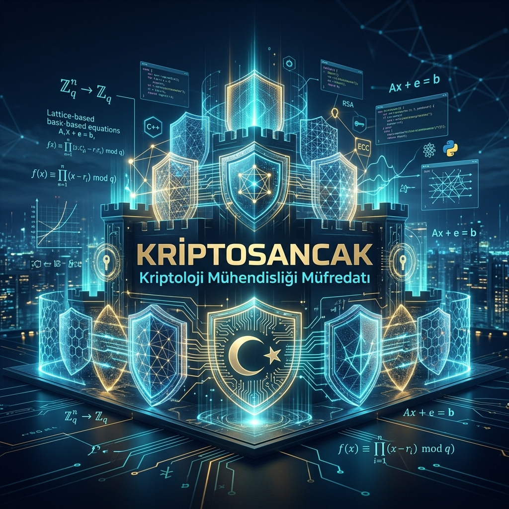
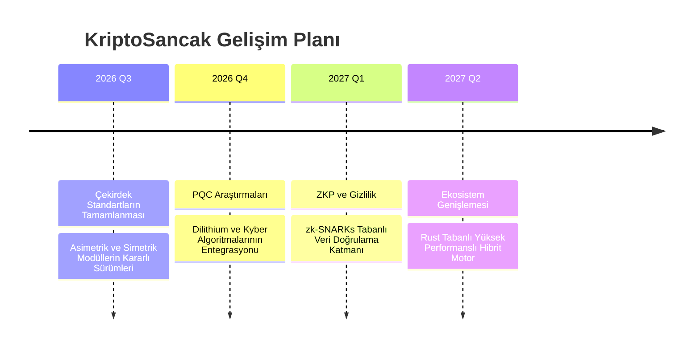
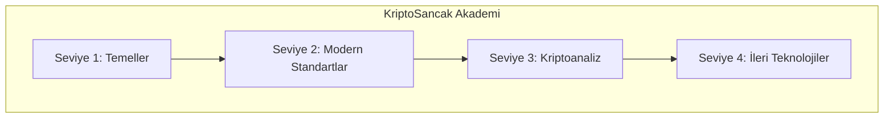

# <p align="center">🎓 KriptoSancak: Kriptoloji Mühendisliği Müfredatı 🎓</p>

<p align="center">
  
</p>

<p align="center">
  <strong>Bu depo, dijital dünyada veri güvenliğini inşa edecek olan "Kriptoloji Mühendisleri" için hazırlanmış kapsamlı bir eğitim müfredatı, teknik dökümantasyon arşivi ve mühendislik uygulama merkezidir.</strong>
</p>

<p align="center">
  
  
  
  
</p>

---

## 📄 Teknik Whitepaper

Projenin felsefesi, matematiksel temelleri ve mimari kararları için hazırladığımız teknik dökümana buradan ulaşabilirsiniz:

👉 **[Teknik Whitepaper'ı Oku](docs/whitepaper.md)**

---

## 🛡️ Misyon ve Mühendislik Yaklaşımı

KriptoSancak, **"Gözlem yoluyla güvenlik"** yerine **"Tasarım yoluyla güvenlik" (Security by Design)** ilkesini benimser. Sadece algoritmaların uygulanmasını değil, bu algoritmaların donanım ve yazılım katmanlarındaki güvenli implementasyonlarını, yan kanal saldırılarına karşı dirençlerini ve matematiksel doğruluklarını odağına alır.

### 📐 Mühendislik Prensiplerimiz
1.  **Sabit Zamanlı Kodlama (Constant-Time):** Gizli veriye dayalı dallanmalardan ve bellek erişim modellerinden kaçınarak zamanlama saldırılarını (timing attacks) imkansız kılıyoruz.
2.  **Yan Kanal Direnci:** Güç analizi (DPA) ve elektromanyetik sızıntılara karşı algoritmik maskeleme tekniklerini araştırıyoruz.
3.  **Sıfır Güven (Zero-Trust) Mimarisi:** Anahtarların sadece ihtiyaç anında ve izole edilmiş bellek alanlarında (TEE/HSM simülasyonları) var olmasını sağlıyoruz.

---

## 🧬 Teknik Çekirdek ve Spesifikasyonlar

### 1. Simetrik Katman (Symmetric Layer)
*   **AES-256-GCM:** NIST SP 800-38D standardına uygun, kimlik doğrulamalı şifreleme (AEAD). 96-bit nonce ve 128-bit authentication tag ile veri bütünlüğü ve gizliliği eşzamanlı sağlanır.
*   **ChaCha20-Poly1305:** RFC 8439 uyumlu, özellikle donanım hızlandırması olmayan sistemlerde (IoT/Mobil) yüksek performans sunan akış şifreleyici.

### 2. Asimetrik Katman (Asymmetric Layer)
*   **Ed25519 (EdDSA):** RFC 8032 standardında, Curve25519 üzerinde yüksek performanslı ve güvenli dijital imza mekanizması.
*   **X25519 (ECDH):** Eliptik eğri Diffie-Hellman anahtar değişimi ile kuantum öncesi en güvenli anahtar mutabakatı.

### 3. Araştırma ve Gelecek Vizyonu (Research POCs)
*   **ZKP (Pedersen Commitments):** $C = g^m h^r \pmod p$ formülüyle veri gizliliğini koruyan taahhüt mekanizması.
*   **Homomorfik Şifreleme (HE):** Şifreli metinler üzerinde toplama işlemi yapabilen pedagojik Paillier benzeri implementasyon.
*   **PQC (LWE):** "Learning With Errors" problemi üzerine kurulu, kuantum saldırılarına dirençli kafes tabanlı şifreleme simülasyonu.

---

## 🔬 Araştırma ve Teknik Derin İnceleme

KriptoSancak, mühendislik disiplinini akademik araştırmalarla besler. Aşağıda projenin odaklandığı ileri düzey teknik alanlar hakkında detaylı bilgiler yer almaktadır.

### ⚛️ 1. Post-Quantum Kriptografi (PQC) ve Kuantum Tehdidi
Mevcut asimetrik sistemler (RSA, ECC), kuantum bilgisayarların çalıştırabileceği **Shor Algoritması** karşısında teorik olarak savunmasızdır.
- **Tehdit Mekanizması:** Shor algoritması, asal çarpanlara ayırma ve ayrık logaritma problemlerini polinom zamanda çözebilir. Bu durum, internetin temelini oluşturan TLS/SSL el sıkışmalarını geçersiz kılar.
- **Kafes Tabanlı Çözümler:** PQC modülümüzde temel aldığımız **LWE (Learning With Errors)** problemi, "En Kısa Vektör Problemi" (SVP) gibi kafes tabanlı zorluklara dayanır. Bu problemlerin kuantum bilgisayarlar tarafından bile üstel zamanda çözülemeyeceği öngörülmektedir.
- **FO-Transform (Fujisaki-Okamoto):** Modern KEM (Key Encapsulation Mechanism) şemalarında (Kyber gibi), CCA güvenliği sağlamak için kullanılan bu dönüşüm, yan kanal analizleri için kritik bir hedef haline gelmektedir.

### 🛡️ 2. Yan Kanal Saldırıları (Side-Channel Attacks - SCA)
Matematiksel olarak "kırılamaz" olan bir algoritma, fiziksel dünyada çalışırken sızıntı yapabilir.
- **Güç ve EM Analizi:** İşlemcinin şifreleme sırasında tükettiği akım (SPA/DPA) veya yaydığı elektromanyetik dalgalar, gizli anahtar hakkında bilgi sızdırabilir.
- **Maskeleme (Masking):** KriptoSancak çekirdeklerinde hedeflediğimiz bu teknikte, hassas değerler rastgele parçalara (shares) bölünür. Saldırganın anahtara ulaşması için tüm parçaları aynı anda sızıntıdan elde etmesi gerekir.
- **Zamanlama Saldırıları:** `if-else` bloklarının veya bellek erişim sürelerinin işlenen veriye göre değişmesi, saldırganın anahtarı tahmin etmesine olanak tanır. Çözüm: **Constant-Time Coding.**

### 🕵️ 3. Sıfır Bilgi Kanıtları (ZKP) ve Fiziksel Güvenlik
ZKP protokolleri (zk-SNARKs, zk-STARKs), veriyi paylaşmadan doğruluğunu ispatlar. Ancak bu işlem fiziksel bir donanımda yapıldığında "Sıfır Bilgi" vaadi risk altına girebilir.
- **Prover Sızıntısı:** Kanıtlayıcı (Prover) tarafında yapılan skaler çarpımlar veya polinom değerlendirmeleri, yan kanal saldırılarına (SCA) maruz kalarak "tanık" (witness) verisini sızdırabilir.
- **Mühendislik Odak Noktası:** ZKP protokollerinin donanım implementasyonlarında, matematiksel ispatın ötesinde fiziksel sızıntı koruması (masking-friendly circuits) bir zorunluluktur.

---

## 🗺️ Gelecek Yol Haritası (2026-2027)



---

## 🎓 Kriptoloji Mühendisliği Müfredatı

KriptoSancak Akademi bünyesinde, teorik matematiği pratik uygulama ile birleştiren 4 seviyeli bir uzmanlaşma yolu sunuyoruz.

### 🗺️ Eğitim Yol Haritası



| Seviye | Odak Noktası | Anahtar Kavramlar |
| :--- | :--- | :--- |
| **📘 Seviye 1** | **Matematiksel Temeller** | Sayılar Teorisi, Modüler Aritmetik, Soyut Cebir, Klasik Şifreler |
| **📗 Seviye 2** | **Modern Standartlar** | AES, RSA, ECC, Hash Fonksiyonları, PKI, TLS/SSL |
| **📙 Seviye 3** | **Kriptoanaliz** | Diferansiyel/Lineer Analiz, Yan Kanal Saldırıları, Güvenli Kodlama |
| **📕 Seviye 4** | **İleri Teknolojiler** | PQC (Kuantum Sonrası), ZKP, Homomorfik Şifreleme, MPC |

👉 **[Müfredatın Tamamını İncele ve Başla](curriculum/README.md)**

---

## 📄 Teknik Dökümantasyon
- 📘 [Teknik Whitepaper](docs/whitepaper.md) - Proje felsefesi ve mimari detaylar.
- ⚙️ [API Referans Rehberi](docs/api.md) - Yazılımcılar için modül kullanım rehberi.
- 📚 [Okuma Listesi](docs/reading_list.md) - Kriptoloji dünyasının temel eserleri.

---

## 🚀 Hızlı Başlangıç

### 1. Kurulum
```bash
git clone https://github.com/arch-yunus/KriptoSancak.git
cd KriptoSancak
pip install -r requirements.txt
```

### 2. CLI Kullanım Örnekleri
```bash
# Simetrik Şifreleme
python ksancak.py encrypt -a aes -d "Gizli Veri"

# Dijital İmza Üretimi
python ksancak.py sign -d "Döküman İçeriği"

# Homomorfik Toplama (HE)
python ksancak.py he -m1 15 -m2 25
```

---

## 📊 Performans Verileri

Algoritmalarımızın verimliliği, mühendislik disiplinimizin en somut göstergesidir.

| Algoritma | İşlem | Kapasite (Hız) |
| :--- | :--- | :--- |
| **AES-256-GCM** | Decryption | **~3200 MB/sn** |
| **ChaCha20** | Encryption | **~1800 MB/sn** |
| **SHA3-256** | Hashing | **~570 MB/sn** |
| **Ed25519** | Signing | **~35,000 op/sn** |

---

## 📂 Proje Mimarisi

```text
KriptoSancak/
├── core/             # Kriptografik çekirdek (AES, EdDSA, Hashing)
├── post_quantum/     # Kuantum sonrası (LWE, Lattice) çalışmaları
├── privacy/          # ZKP, DID ve Homomorfik Şifreleme modülleri
├── benchmarks/       # Hız ve performans analiz araçları
├── tests/            # Unit test suite (unittest)
├── docs/             # Whitepaper, API Docs, Okuma Listesi
└── curriculum/       # 4 Seviyeli Eğitim Müfredatı
```

---

## ❓ Sıkça Sorulan Sorular (SSS)

**S: Bu projeyi üretim ortamında kullanabilir miyim?**  
C: `core` modülleri standartlara uygun olsa da, `post_quantum` ve `privacy` modülleri araştırma amaçlı (POC) seviyesindedir. Üretim öncesi profesyonel denetim önerilir.

**S: Neden Python kullanıldı?**  
C: Müfredat odaklı bir proje olduğu için kodun okunabilirliği önceliğimizdir. Performans gerektiren çekirdek yapılar ileride Rust/C++ ile hibrit hale getirilecektir.

---

## 🤝 Katkıda Bulunma ve Komünite

KriptoSancak bir topluluk sancağıdır. Bu sancağı daha ileriye taşıyabilirsin:
1.  Yeni bir algoritma önerisi veya matematiksel iyileştirme için **Issue** açın.
2.  Geliştirmelerinizi **Feature Branch** üzerinde yapın.
3.  Güvenlik analizleri ve test senaryolarıyla birlikte **Pull Request** gönderin.

---

<p align="center">
  <i>"Gelecek, onu şifreleyenlerin elindedir."</i>
</p>