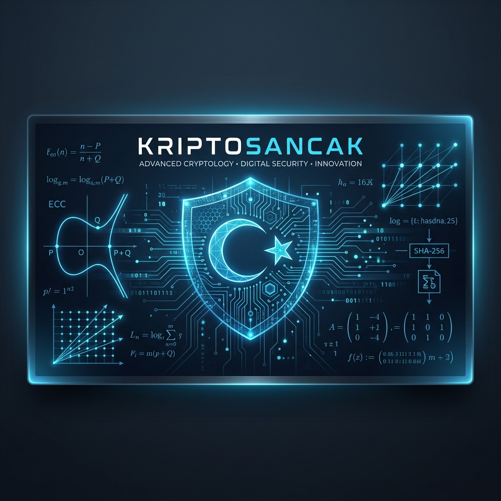
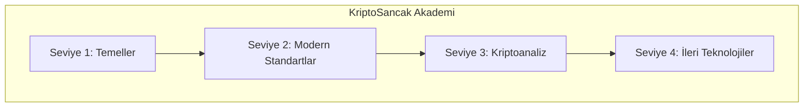

# <p align="center">🎓 KriptoSancak: Kriptoloji Mühendisliği Müfredatı 🎓</p>

<p align="center">
  
</p>

<p align="center">
  <strong>Bu depo, dijital dünyada veri güvenliğini inşa edecek olan "Kriptoloji Mühendisleri" için hazırlanmış kapsamlı bir eğitim müfredatı, teknik dökümantasyon arşivi ve mühendislik uygulama merkezidir.</strong>
</p>

<p align="center">
  
  
  
  
</p>

---

## 📄 Teknik Whitepaper

Projenin felsefesi, matematiksel temelleri ve mimari kararları için hazırladığımız teknik dökümana buradan ulaşabilirsiniz:

👉 **[Teknik Whitepaper'ı Oku](docs/whitepaper.md)**

---

## 🛡️ Misyon ve Mühendislik Yaklaşımı

KriptoSancak, **"Gözlem yoluyla güvenlik"** yerine **"Tasarım yoluyla güvenlik" (Security by Design)** ilkesini benimser. Sadece algoritmaların uygulanmasını değil, bu algoritmaların donanım ve yazılım katmanlarındaki güvenli implementasyonlarını, yan kanal saldırılarına karşı dirençlerini ve matematiksel doğruluklarını odağına alır.

---

## 🧬 Teknik Çekirdek

### 1. Klasik Kriptografi Katmanı
*   **Simetrik Güvenlik:** AES-GCM (256-bit) ve ChaCha20-Poly1305 ile yüksek performanslı veri şifreleme.
*   **Asimetrik Yapılar:** Elliptic Curve Cryptography (Ed25519, NIST P-256) ve güvenli anahtar değişim protokolleri (ECDH).
*   **Bütünlük Kontrolü:** SHA-3 (Keccak) ailesi ve HMAC tabanlı veri doğrulama mekanizmaları.

### 2. Gelişmiş Protokoller
*   **Sıfır Bilgi Kanıtları (ZKP):** Veriyi ifşa etmeden doğruluğunu ispatlayan protokol tasarımları.
*   **Homomorfik Şifreleme:** Veri üzerinde şifreli haldeyken işlem yapabilme yeteneği üzerine araştırma ve POC çalışmaları.

---

## 🚀 Gelecek Vizyonu ve Stratejik Yol Haritası

KriptoSancak, teknolojik tekilliğe ve kuantum çağının getireceği tehditlere karşı bir hazırlık manifestosudur.

#### **I. Kuantum Sonrası Direnç (PQC)**
Mevcut şifreleme standartlarının kuantum bilgisayarlar karşısındaki zafiyetini öngörüyoruz. Vizyonumuz, **Kafes Tabanlı (Lattice-based)** ve **Hata Düzeltme Kodlu** algoritmaları sistemin merkezine entegre ederek "Q-Day" (Kuantum Günü) için hazır bir sığınak inşa etmektir.

#### **II. Veri Egemenliği ve Otonomi**
Gelecekte veri, merkezi olmayan otoriteler tarafından yönetilecektir. KriptoSancak, **Merkeziyetsiz Kimlik (DID)** ve **Kendi Kendini Yöneten Kimlik (SSI)** sistemleri için gerekli olan kriptografik altyapıyı geliştirerek, verinin kontrolünü nihai sahibine geri vermeyi hedefler.

#### **III. Akıllı ve Dinamik Savunma**
Güvenlik statik bir duvar değil, yaşayan bir organizmadır. Gelecek planlarımız arasında, saldırı vektörlerini analiz ederek kriptografik parametrelerini (anahtar uzunluğu, algoritma tipi vb.) anlık olarak değiştirebilen **Otonom Şifreleme Katmanları** yer almaktadır.

---

## 🎓 Kriptoloji Mühendisliği Müfredatı

KriptoSancak, sadece bir teknoloji merkezi değil, aynı zamanda bir eğitim ocağıdır. Sektöre nitelikli kriptoloji mühendisleri kazandırmak amacıyla hazırladığımız sistemli müfredat, teorik yetkinliği pratik uygulama becerisiyle birleştirir.

### 🗺️ Eğitim Yol Haritası



| Seviye | Odak Noktası | Anahtar Kavramlar |
| :--- | :--- | :--- |
| **📘 Seviye 1** | **Matematiksel Temeller** | Sayılar Teorisi, Modüler Aritmetik, Soyut Cebir, Klasik Şifreler |
| **📗 Seviye 2** | **Modern Standartlar** | AES, RSA, ECC, Hash Fonksiyonları, PKI, TLS/SSL |
| **📙 Seviye 3** | **Kriptoanaliz** | Diferansiyel/Lineer Analiz, Yan Kanal Saldırıları, Güvenli Kodlama |
| **📕 Seviye 4** | **İleri Teknolojiler** | PQC (Kuantum Sonrası), ZKP, Homomorfik Şifreleme, MPC |

👉 **[Müfredatın Tamamını İncele ve Başla](curriculum/README.md)**

---

## 🚀 Hızlı Başlangıç

KriptoSancak araçlarını terminal üzerinden hemen kullanmaya başlayabilirsiniz.

### 1. Kurulum
```bash
# Bağımlılıkları yükleyin
pip install cryptography
```

### 2. Temel Kullanım (CLI)
```bash
# Veri şifreleme (AES-256-GCM)
python ksancak.py encrypt -a aes -d "Gizli Mesaj"

# SHA-3 Hashing
python ksancak.py hash -d "Bütünlük Kontrolü"

# Dijital İmza (Ed25519)
python ksancak.py sign -d "Döküman İçeriği"

# Pedersen Commitment (ZKP POC)
python ksancak.py commit -m 42
```

---

## 📊 Performans Verileri

Mühendislik disiplinimizin bir sonucu olarak, algoritmalarımız yüksek hız ve düşük gecikme süresi ile çalışır. (Test ortamı: Python 3.12, x64 Architecture)

| Algoritma | İşlem Tipi | Performans |
| :--- | :--- | :--- |
| **AES-256-GCM** | Şifre Çözme | **~3200 MB/sn** |
| **ChaCha20-Poly1305** | Şifreleme | **~1800 MB/sn** |
| **SHA3-256** | Özetleme | **~570 MB/sn** |
| **Ed25519** | İmzalama | **~35,000 op/sn** |
| **Ed25519** | Doğrulama | **~11,000 op/sn** |

---

## 📂 Proje Yapısı

```text
KriptoSancak/
├── curriculum/       # Kriptoloji Mühendisliği Müfredatı
├── core/             # Temel algoritmalar ve matematiksel kütüphaneler
├── post-quantum/     # Kuantum dirençli algoritma çalışmaları
├── privacy/          # ZKP ve mahremiyet odaklı implementasyonlar
├── benchmarks/       # Performans ve entropi analizleri
├── docs/             # Teknik makaleler ve mühendislik notları
└── assets/           # Görsel varlıklar ve medya
```

---

## ⚠️ Önemli Uyarı

Bu proje, kriptoloji mühendisliği üzerine yapılan ileri düzey araştırmaları içermektedir. Deneysel aşamadaki (özellikle PQC ve ZKP) modüllerin üretim ortamlarında kullanılması risk taşıyabilir. Her modül, **"Broken by Design"** testlerinden başarıyla geçtikten sonra kararlı sürüme aktarılır.

---

## 🤝 Katkıda Bulunma

KriptoSancak bir topluluk sancağıdır. Matematiksel ispatlar, kod optimizasyonları veya yeni algoritma önerileri ile bu sancağı daha ileriye taşıyabilirsiniz.

1. `issue` açarak tartışma başlatın.
2. `feature` dalında geliştirmeyi yapın.
3. Güvenlik analizleriyle birlikte `pull request` gönderin.

---
<p align="center">
  <i>"Gelecek, onu şifreleyenlerin elindedir."</i>
</p>